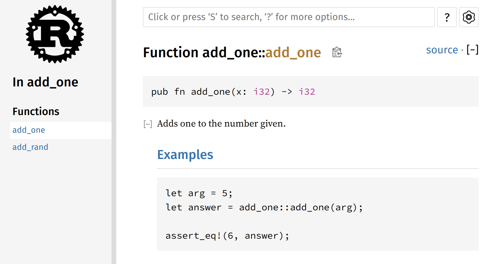
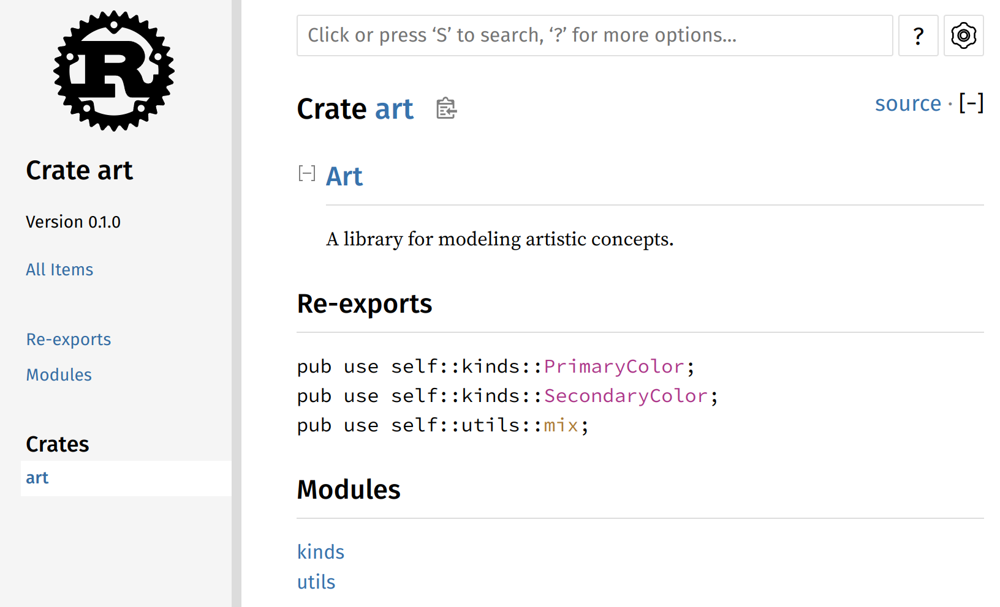

# Cargo Project

- book: [Managing Growing Projects with Packages, Crates, and Modules](https://doc.rust-lang.org/book/ch07-00-managing-growing-projects-with-packages-crates-and-modules.html)
- [API Guidelines](https://rust-lang.github.io/api-guidelines/)

Organize code by splitting it into multiple modules and then multiple files.

- **Packages**: A Cargo feature that lets you build, test, and share crates
- **Crates**: A tree of modules that produces a library or executable
- **Modules** and **use**: Let you control the organization, scope, and privacy of paths
- **Paths**: A way of naming an item, such as a struct, function, or module

## Start

### Crate

- `rustc file.rs`
  - **the smallest amount of code** that the Rust compiler considers at a time.
- can contain modules(may be defined in other files that get compiled with the crate)
- form:
  - **Binary crates**: must have a `main` function
    - `src/main.rs`
    - command-line program, server
  - **Library crates**: don’t have a `main` function
    - `src/lib.rs`
- **crate root**: a source file that the Rust compiler starts from and makes up the root module of your crate
  - `src/main.rs`
  - `src/lib.rs`

### Package

- a bundle of one or more crates that provides a set of functionality
- contains a `Cargo.toml`: describes how to build those crates

### Module

#### binary crate: backyard

- backyard
  - Cargo.lock
  - Cargo.toml
  - src
    - [main.rs](backyard/src/main.rs)
    - [garden.rs](backyard/src/garden.rs)
    - garden
      - [vegetables.rs](backyard/src/garden/vegetables.rs) 

##### src/main.rs

```rs
use crate::garden::vegetables::Asparagus;

pub mod garden; // tells the compiler to include the code it finds in `src/garden.rs`

fn main() {
    let plant = Asparagus {};
    println!("I'm growing {:?}!", plant);
}
```

##### src/garden.rs

```rs
pub mod vegetables;
```

##### src/garden/vegetables.rs

```rs
#[derive(Debug)]
pub struct Asparagus {}
```

#### library crate: restaurant

```bash
cargo new --lib restaurant
cargo build
```

- restaurant
  - Cargo.lock
  - Cargo.toml
  - src
    - [lib.rs](restaurant/src/lib.rs)

##### module tree

```bash
crate
 ├── front_of_house
 │   ├── **pub** hosting
 │   │   ├── **pub** add_to_waitlist
 │   │   └── seat_at_table
 │   └── serving
 │       ├── take_order
 │       ├── serve_order
 │       └── take_payment
 └── back_of_house
     ├── **pub** struct Breakfast
     │   └── **pub** fn summer
     ├── **pub** enum Appetizer
     ├── fix_incorrect_order
     └── cook_order
```

##### Re-exporting

```rs
mod front_of_house {
    pub mod hosting {
        pub fn add_to_waitlist() {}
    }
}

pub use crate::front_of_house::hosting;

pub fn eat_at_restaurant() {
    hosting::add_to_waitlist();
}
```

call: `restaurant::hosting::add_to_waitlist()`

##### use

```rs
use std::cmp::Ordering;
use std::io;
// or
use std::{cmp::Ordering, io};
```

```rs
use std::io;
use std::io::Write;
// or
use std::io::{self, Write};
```

```rs
use std::collections::*;
```

#### library crate: restaurant_mods

```bash
cargo new --lib restaurant_mods
cargo build
```

- restaurant
  - Cargo.lock
  - Cargo.toml
  - src
    - [lib.rs](restaurant_mods/src/lib.rs)
    - [front_of_house.rs](restaurant_mods/src/front_of_house.rs)
    - front_of_house
      - [hosting.rs](restaurant_mods/src/front_of_house/hosting.rs)

---

## More Cargo

- book: [More About Cargo and Crates.io](https://doc.rust-lang.org/book/ch14-00-more-about-cargo.html)
- [Cargo Book](https://doc.rust-lang.org/cargo/)

### Customizing Builds with Release Profiles

- book: [Customizing Builds with Release Profiles](https://doc.rust-lang.org/book/ch14-01-release-profiles.html)

[/src/helloworld/Cargo.toml](/src/helloworld/Cargo.toml)

optimization range: 0 ~ 3 

```toml
[profile.dev]
opt-level = 0

[profile.release]
opt-level = 3
```

```bash
cargo build # dev profile
  Finished dev [unoptimized + debuginfo] target(s) in 0.00s

cargo build --release # release profile
  Finished release [optimized] target(s) in 0.10s
```

### Cargo Workspaces

- book: [Cargo Workspaces](https://doc.rust-lang.org/book/ch14-03-cargo-workspaces.html)

workspace: a set of packages that share the same `Cargo.lock` and output directory.

- [add](add)
  - [Cargo.toml](add/Cargo.toml)
  - [adder/src/main.rs](add/adder/src/main.rs)
  - [adder/Cargo.toml](add/adder/Cargo.toml)
  - [add_one/src/lib.rs](add/add_one/src/lib.rs)
  - [add_two/src/lib.rs](add/add_two/src/lib.rs)

#### packages

```bash
cargo new adder
cargo new add_one --lib
cargo new add_two --lib
```

#### Cargo.toml of a workspace 

```toml
[workspace]

members = [
  "adder",
  "add_one",
  "add_two"
]
```

#### Build a workspace

```bash
cargo build
```

```bash
add/
├── Cargo.lock
├── Cargo.toml
├── add_one/
│   ├── Cargo.toml
│   └── src/
│       └── lib.rs
├── add_two/
│   ├── Cargo.toml
│   └── src/
│       └── lib.rs
├── adder/
│   ├── Cargo.toml
│   └── src/
│       └── main.rs
└── target/
```

#### Run the binary

```bash
cargo run -p adder
```

```bash
10 plus one is 11!
10 plus two is 12!
```

#### External package in a workspace

add `rand` in [add/add_one/Cargo.toml](add/add_one/Cargo.toml)

```toml
[dependencies]
rand = "0.8.5"
```

error: use `rand` in `adder/src/main.rs` 

```bash
error[E0432]: unresolved import `rand`
 --> adder/src/main.rs:3:5
  |
3 | use rand::Rng;
  |     ^^^^ use of undeclared crate or module `rand`
```

fix: add `rand` in `adder/Cargo.toml`

#### Tests

```rs
#[cfg(test)]
mod tests {
    use super::*;

    #[test]
    fn it_works() {
        assert_eq!(3, add_one(2));
    }
}
```

```bash
cargo test
cargo test -p add_one

running 1 test
test tests::it_works ... ok

...
```

### Publishing a Crate to Crates.io

- book: [Publishing a Crate to Crates.io](https://doc.rust-lang.org/book/ch14-02-publishing-to-crates-io.html)

[add/add_one/src/lib.rs](add/add_one/src/lib.rs)

```rs
/// Adds one to the number given.
///
/// # Examples
///
/// ```rs
/// let arg = 5;
/// let answer = add_one::add_one(arg);
///
/// assert_eq!(6, answer);
/// ```
pub fn add_one(x: i32) -> i32 {
    x + 1
}
```

#### Documentation comments

```bash
cargo doc --open
```



#### Test example code

```bash
cargo test

running 1 test
test tests::it_works ... ok

test result: ok. 1 passed; 0 failed; 0 ignored; 0 measured; 0 filtered out; finished in 0.00s
```

#### Export API with pub use

- [art/src/lib.rs](art/src/lib.rs)
- [art/src/main.rs](art/src/main.rs)

```rs
// main.rs
use art::mix; // <- use art::kinds::PrimaryColor;
use art::PrimaryColor; // <- use art::utils::mix;
```

```rs
pub use self::kinds::PrimaryColor;
pub use self::kinds::SecondaryColor;
pub use self::utils::mix;

pub mod kinds {
    pub enum PrimaryColor {
// ... 
```



#### Crates.io

1. login: [crates.io](https://crates.io)
2. new [API Tokens](https://crates.io/settings/tokens)
3. `cargo login <TOKEN>` (save in `~/.cargo/credentials` by default)

```bash
cargo login abcdefghijklmnopqrstuvwxyz012345
  Login token for `crates.io` saved
```

```bash
cat ~/.cargo/credentials

[registry]
token = "abcdefghijklmnopqrstuvwxyz012345"
```

##### Add metadata to a crate

[/src/learn/guessing_game/Cargo.toml](/src/learn/guessing_game/Cargo.toml)

```toml
[package]
name = "guessing_game"
version = "0.1.0"
edition = "2021"
description = "A fun game where you guess what number the computer has chosen."
license = "MIT"

[dependencies]
rand = "0.8.5"
```

##### Publish the crate

```bash
# cargo publish
```

##### Deprecating versions

```bash
cargo yank --vers 1.0.1
cargo yank --vers 1.0.1 --undo
```

### Installing Binaries from Crates.io with cargo install

- book: [Installing Binaries with cargo install](https://doc.rust-lang.org/book/ch14-04-installing-binaries.html)

default install path: `$HOME/.cargo/bin`

```bash
cargo install ripgrep
```

```bash
rg --help | rg github

Project home page: https://github.com/BurntSushi/ripgrep
```

### Extending Cargo with Custom Commands

- book: [Extending Cargo with Custom Commands](https://doc.rust-lang.org/book/ch14-05-extending-cargo.html)


```bash
cargo subcommand

cargo clippy
cargo fmt
```

```bash
~/.cargo/bin
├── cargo
├── cargo-clippy
├── cargo-fmt
├── cargo-miri
# ...
```

