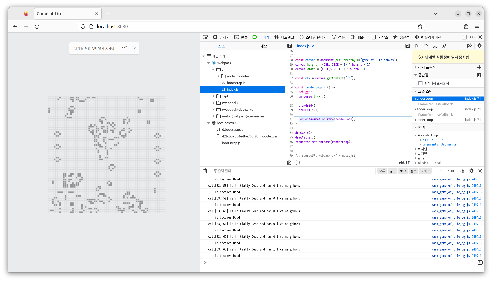
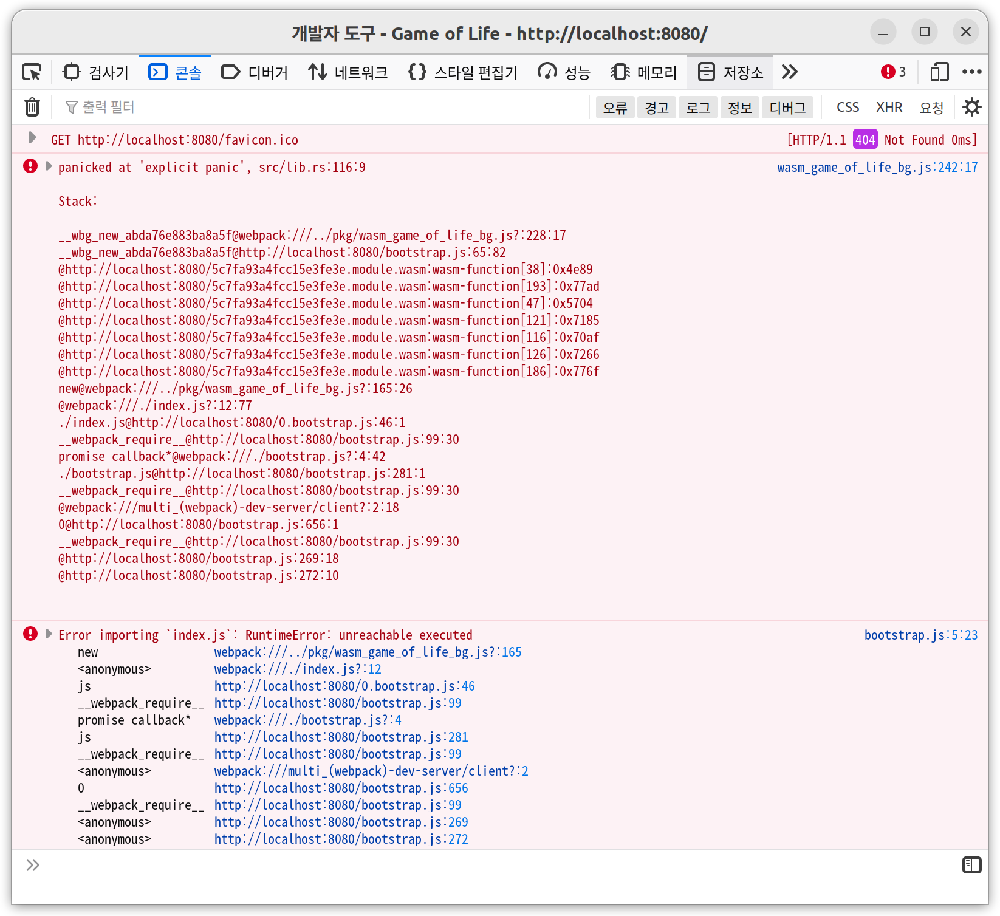
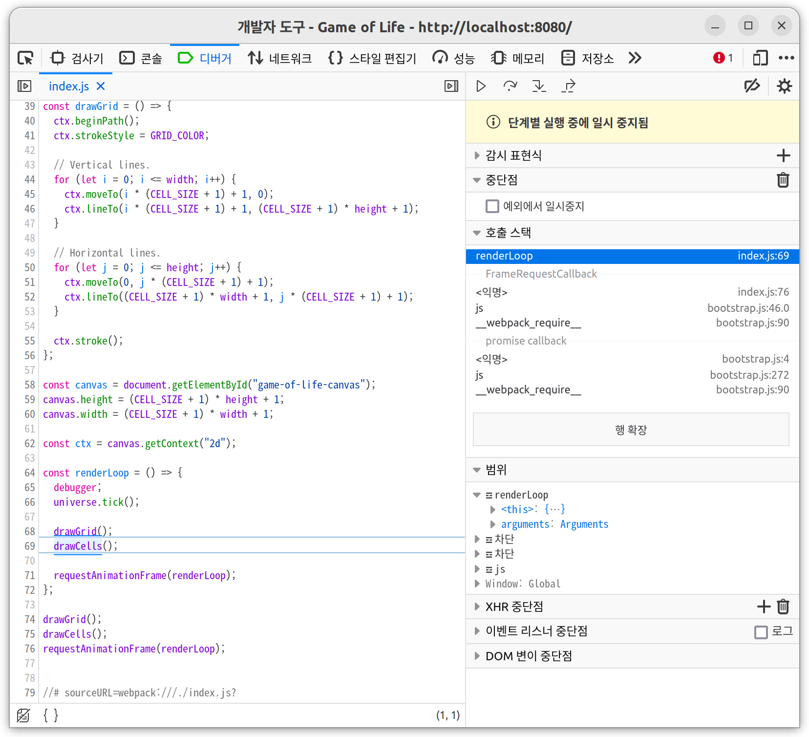

# Debugging

[console_error_panic_hook](https://github.com/rustwasm/console_error_panic_hook)

## Code

### utils.rs

```rs
pub fn set_panic_hook() {
    #[cfg(feature = "console_error_panic_hook")]
    console_error_panic_hook::set_once();
}

```

### lib.rs

```rs
extern crate web_sys;

macro_rules! log {
    ( $( $t:tt )* ) => {
        web_sys::console::log_1(&format!( $( $t )* ).into());
    }
}

#[wasm_bindgen]
impl Universe {
  pub fn new() -> Universe {
      utils::set_panic_hook();
  }

  pub fn tick(&mut self) {
    // ...

    log!(
        "cell[{}, {}] is initially {:?} and has {} live neighbors",
        row,
        col,
        cell,
        live_neighbors
    );

    // ...

    log!("    it becomes {:?}", next_cell);

    // ...
  }
}
```

### Cargo.toml

```toml
[dependencies]
# ...

[dependencies.web-sys]
version = "0.3"
features = [
  "console",
]
```

### www/index.js

```js
const renderLoop = () => {
  debugger;
  universe.tick();

  drawGrid();
  drawCells();

  requestAnimationFrame(renderLoop);
};
```

### Run Debugger

```bash
wasm-pack build
cd www
npm run start
```



---

## Panic

### When Panic

#### lib.rs

```rs
pub fn new() -> Universe{
  panic!();
}
```



### Without Hook

#### lib.rs

```rs
pub fn new() -> Universe {
    // utils::set_panic_hook();
}
```


