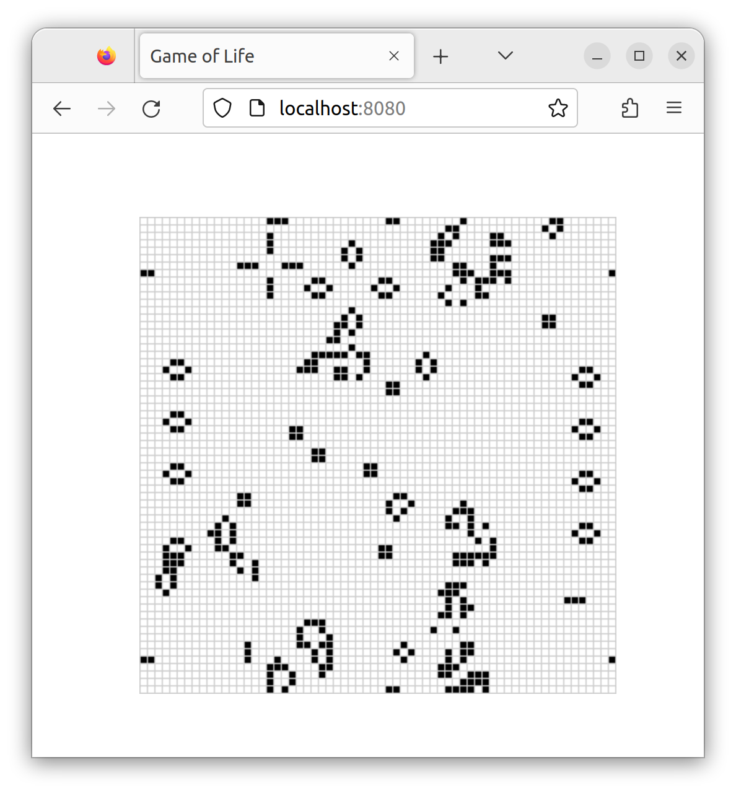

# Implementing Conway's Game of Life

## Rust and Javascript

### Linear memory space

- `wasm_bindgen`

---

## Code

### src/lib.rs

```bash
wasm-pack build
```

#### Cell

```rs
#[wasm_bindgen]
#[repr(u8)] // a single byte
#[derive(Clone, Copy, Debug, PartialEq, Eq)]
pub enum Cell {
    Dead = 0,
    Alive = 1,
}
```

#### Universe

formula: `index(row, column, universe) = row * width(universe) + column`

```rs
#[wasm_bindgen]
pub struct Universe {
    width: u32,
    height: u32,
    cells: Vec<Cell>,
}

#[wasm_bindgen]
impl Universe {
    fn get_index(&self, row: u32, column: u32) -> usize {
        (row * self.width + column) as usize
    }

    fn live_neighbor_count(&self, row: u32, column: u32) -> u8 {
        let mut count = 0;
        for delta_row in [self.height - 1, 0, 1].iter().cloned() {
            for delta_col in [self.width - 1, 0, 1].iter().cloned() {
                if delta_row == 0 && delta_col == 0 {
                    continue;
                }

                let neighbor_row = (row + delta_row) % self.height;
                let neighbor_col = (column + delta_col) % self.width;
                let idx = self.get_index(neighbor_row, neighbor_col);
                count += self.cells[idx] as u8;
            }
        }
        count
    }

    pub fn tick(&mut self) {
        let mut next = self.cells.clone();

        for row in 0..self.height {
            for col in 0..self.width {
                let idx = self.get_index(row, col);
                let cell = self.cells[idx];
                let live_neighbors = self.live_neighbor_count(row, col);

                let next_cell = match (cell, live_neighbors) {
                    // Rule 1: Any live cell with fewer than two live neighbours
                    // dies, as if caused by underpopulation.
                    (Cell::Alive, x) if x < 2 => Cell::Dead,
                    // Rule 2: Any live cell with two or three live neighbours
                    // lives on to the next generation.
                    (Cell::Alive, 2) | (Cell::Alive, 3) => Cell::Alive,
                    // Rule 3: Any live cell with more than three live
                    // neighbours dies, as if by overpopulation.
                    (Cell::Alive, x) if x > 3 => Cell::Dead,
                    // Rule 4: Any dead cell with exactly three live neighbours
                    // becomes a live cell, as if by reproduction.
                    (Cell::Dead, 3) => Cell::Alive,
                    // All other cells remain in the same state.
                    (otherwise, _) => otherwise,
                };

                next[idx] = next_cell;
            }
        }

        self.cells = next;
    }

    pub fn new() -> Universe {
        let width = 64;
        let height = 64;

        let cells = (0..width * height)
            .map(|i| {
                if i % 2 == 0 || i % 7 == 0 {
                    Cell::Alive
                } else {
                    Cell::Dead
                }
            })
            .collect();

        Universe {
            width,
            height,
            cells,
        }
    }

    pub fn render(&self) -> String {
        self.to_string()
    }
}
```

```rs
use std::fmt;

impl fmt::Display for Universe {
    fn fmt(&self, f: &mut fmt::Formatter) -> fmt::Result {
        for line in self.cells.as_slice().chunks(self.width as usize) {
            for &cell in line {
                let symbol = if cell == Cell::Dead { '◻' } else { '◼' };
                write!(f, "{}", symbol)?;
            }
            write!(f, "\n")?;
        }

        Ok(())
    }
}
```

### www/index.html

```html
<head>
  <style>
    body {
      position: absolute;
      top: 0;
      left: 0;
      width: 100%;
      height: 100%;
      display: flex;
      flex-direction: column;
      align-items: center;
      justify-content: center;
    }
  </style>
</head>
<body>
  <pre id="game-of-life-canvas"></pre>
  <script src="./bootstrap.js"></script>
</body>
```

### www/index.js

#### import Universe

```js
import { Universe } from "wasm-game-of-life";
```

#### Text

```js
const pre = document.getElementById("game-of-life-canvas");
const universe = Universe.new();
```

#### Render

```js
const renderLoop = () => {
  pre.textContent = universe.render();
  universe.tick();

  requestAnimationFrame(renderLoop);
};

requestAnimationFrame(renderLoop);
```

### Run start

```bash
cd www
npm run start
```


---

## Memory Control

### www/index.html

#### Canvas API

```html
<canvas id="game-of-life-canvas"></canvas>
```

### lib.rs

#### Universe

```rs
#[wasm_bindgen]
impl Universe {
    pub fn width(&self) -> u32 {
        self.width
    }

    pub fn height(&self) -> u32 {
        self.height
    }

    pub fn cells(&self) -> *const Cell {
        self.cells.as_ptr()
    }
}
```

### www/index.js

#### Color

```js
import { Universe, Cell } from "wasm-game-of-life";

const CELL_SIZE = 5; // px
const GRID_COLOR = "#CCCCCC";
const DEAD_COLOR = "#FFFFFF";
const ALIVE_COLOR = "#000000";
```

### Render Canvas

```js
// Construct the universe, and get its width and height.
const universe = Universe.new();
const width = universe.width();
const height = universe.height();

// Give the canvas room for all of our cells and a 1px border
// around each of them.
const canvas = document.getElementById("game-of-life-canvas");
canvas.height = (CELL_SIZE + 1) * height + 1;
canvas.width = (CELL_SIZE + 1) * width + 1;

const ctx = canvas.getContext('2d');

const renderLoop = () => {
  universe.tick();

  drawGrid();
  drawCells();

  requestAnimationFrame(renderLoop);
};

drawGrid();
drawCells();
requestAnimationFrame(renderLoop);
```

#### Drawing Grid

```js
const drawGrid = () => {
  ctx.beginPath();
  ctx.strokeStyle = GRID_COLOR;

  // Vertical lines.
  for (let i = 0; i <= width; i++) {
    ctx.moveTo(i * (CELL_SIZE + 1) + 1, 0);
    ctx.lineTo(i * (CELL_SIZE + 1) + 1, (CELL_SIZE + 1) * height + 1);
  }

  // Horizontal lines.
  for (let j = 0; j <= height; j++) {
    ctx.moveTo(0,                           j * (CELL_SIZE + 1) + 1);
    ctx.lineTo((CELL_SIZE + 1) * width + 1, j * (CELL_SIZE + 1) + 1);
  }

  ctx.stroke();
};
```

#### Drawing Cells with memory control

```js
// Import the WebAssembly memory at the top of the file.
import { memory } from "wasm-game-of-life/wasm_game_of_life_bg";

// ...

const getIndex = (row, column) => {
  return row * width + column;
};

const drawCells = () => {
  const cellsPtr = universe.cells();
  const cells = new Uint8Array(memory.buffer, cellsPtr, width * height);

  ctx.beginPath();

  for (let row = 0; row < height; row++) {
    for (let col = 0; col < width; col++) {
      const idx = getIndex(row, col);

      ctx.fillStyle = cells[idx] === Cell.Dead
        ? DEAD_COLOR
        : ALIVE_COLOR;

      ctx.fillRect(
        col * (CELL_SIZE + 1) + 1,
        row * (CELL_SIZE + 1) + 1,
        CELL_SIZE,
        CELL_SIZE
      );
    }
  }

  ctx.stroke();
};
```

### Rerun

```bash
wasm-pack build
cd www
npm run start
```


