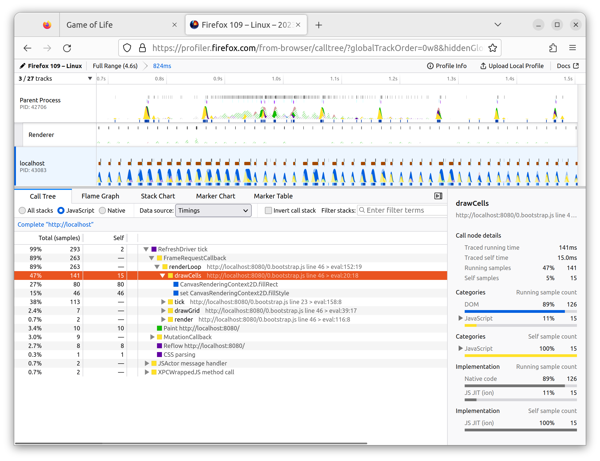

# Time Profile

## Code

### www/index.js

```js
const fps = new class {
  constructor() {
    this.fps = document.getElementById("fps");
    this.frames = [];
    this.lastFrameTimeStamp = performance.now();
  }

  render() {
    // Convert the delta time since the last frame render into a measure
    // of frames per second.
    const now = performance.now();
    const delta = now - this.lastFrameTimeStamp;
    this.lastFrameTimeStamp = now;
    const fps = 1 / delta * 1000;

    // Save only the latest 100 timings.
    this.frames.push(fps);
    if (this.frames.length > 100) {
      this.frames.shift();
    }

    // Find the max, min, and mean of our 100 latest timings.
    let min = Infinity;
    let max = -Infinity;
    let sum = 0;
    for (let i = 0; i < this.frames.length; i++) {
      sum += this.frames[i];
      min = Math.min(this.frames[i], min);
      max = Math.max(this.frames[i], max);
    }
    let mean = sum / this.frames.length;

    // Render the statistics.
    this.fps.textContent = `
Frames per Second:
         latest = ${Math.round(fps)}
avg of last 100 = ${Math.round(mean)}
min of last 100 = ${Math.round(min)}
max of last 100 = ${Math.round(max)}
`.trim();
  }
};
```

```js
const renderLoop = () => {
    fps.render(); //new

    universe.tick();
    drawGrid();
    drawCells();

    animationId = requestAnimationFrame(renderLoop);
};
```

#### www/index.html

```html
<div id="fps"></div>
```

#### Run

```bash
npm run start
```

#### lib.rs

```rs
extern crate web_sys;
use web_sys::console;

pub struct Timer<'a> {
    name: &'a str,
}

impl<'a> Timer<'a> {
    pub fn new(name: &'a str) -> Timer<'a> {
        console::time_with_label(name);
        Timer { name }
    }
}

impl<'a> Drop for Timer<'a> {
    fn drop(&mut self) {
        console::time_end_with_label(self.name);
    }
}
```

```rs
#[wasm_bindgen]
impl Universe {
  pub fn tick(&mut self) {
    let _timer = Timer::new("Universe::tick");
  }
}
```



#### www/index.js

```js
const drawCells = () => {
  const cellsPtr = universe.cells();
  const cells = new Uint8Array(memory.buffer, cellsPtr, width * height);

  ctx.beginPath();

  // Alive cells.
  ctx.fillStyle = ALIVE_COLOR;
  for (let row = 0; row < height; row++) {
    for (let col = 0; col < width; col++) {
      const idx = getIndex(row, col);
      if (cells[idx] !== Cell.Alive) {
        continue;
      }

      ctx.fillRect(
        col * (CELL_SIZE + 1) + 1,
        row * (CELL_SIZE + 1) + 1,
        CELL_SIZE,
        CELL_SIZE
      );
    }
  }

  // Dead cells.
  ctx.fillStyle = DEAD_COLOR;
  for (let row = 0; row < height; row++) {
    for (let col = 0; col < width; col++) {
      const idx = getIndex(row, col);
      if (cells[idx] !== Cell.Dead) {
        continue;
      }

      ctx.fillRect(
        col * (CELL_SIZE + 1) + 1,
        row * (CELL_SIZE + 1) + 1,
        CELL_SIZE,
        CELL_SIZE
      );
    }
  }

  ctx.stroke();
};
```

```js
for (let i = 0; i < 9; i++) {
  universe.tick();
}
```

#### lib.rs

```rs
pub fn tick(&mut self) {
    let _timer = Timer::new("Universe::tick");

    let mut next = {
        let _timer = Timer::new("allocate next cells");
        self.cells.clone()
    };

    {
        let _timer = Timer::new("new generation");
        for row in 0..self.height {
            for col in 0..self.width {
                let idx = self.get_index(row, col);
                let cell = self.cells[idx];
                let live_neighbors = self.live_neighbor_count(row, col);

                let next_cell = match (cell, live_neighbors) {
                    (Cell::Alive, x) if x < 2 => Cell::Dead,
                    (Cell::Alive, 2) | (Cell::Alive, 3) => Cell::Alive,
                    (Cell::Alive, x) if x > 3 => Cell::Dead,
                    (Cell::Dead, 3) => Cell::Alive,
                    (otherwise, _) => otherwise,
                };
                
                next[idx] = next_cell;
            }
        }
    }

    let _timer = Timer::new("free old cells");
    self.cells = next;
}
```

#### benches/bench.rs

```rs
#![feature(test)]

extern crate test;
extern crate wasm_game_of_life;

#[bench]
fn universe_ticks(b: &mut test::Bencher) {
    let mut universe = wasm_game_of_life::Universe::new();

    b.iter(|| {
        universe.tick();
    });
}
```

```bash
rustup toolchain list
rustup toolchain install nightly
rustup override set nightly
cargo install cargo-benchcmp
```

Comment out all the `#[wasm_bindgen]`:

```rs
// #[wasm_bindgen]
```

Comment out `cdylib` in `Cargo.toml`:

```toml

```

```bash
cargo bench | tee before.txt
```
